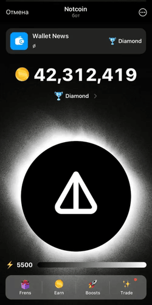

# 🌟 Project Name: **KYC-Clicker** 🌟

## 📖 **Overview**

Our project is a **KYC-Clicker**, where users can interact with a bot to perform a series of actions, such as clicking, upgrading, and earning rewards over time. The goal is to create an engaging, addictive clicker experience right inside Telegram, allowing players to compete, progress, and unlock achievements without leaving the chat platform.

### **Features**:
- **Simple Gameplay**: Players click a button to generate points, which they can use to buy upgrades.
- **Progression System**: Accumulate points and unlock upgrades to boost your clicks per second.
- **Leaderboards**: Compete with other users in real-time for the highest score.
- **Achievements**: Unlock special rewards as you reach milestones.
- **Seamless Telegram Integration**: The game operates entirely within a Telegram chat, allowing players to play from anywhere.

This clicker bot combines fun and strategy, making it a unique experience for Telegram users.

## 🛠 **Technology Stack**

Our project leverages a modern technology stack to ensure scalability, performance, and seamless user interactions:

- **Frontend**: [React, Typescript]
- **Backend**: [Django, Flask, etc.]
- **Database**: [PostgreSQL]
- **Authentication**: [JWT, OAuth, etc.]
- **Deployment**: [Docker]

We have structured our architecture for flexibility and ease of integration with future features.

## 👥 **Participants**

The project is a collaboration of skilled and passionate individuals:

2. **Michael Kostochka**: [Role: Backend Developer, Database Architect]
3. **Sitnikov Arseniy**: [Role: Frontend Developer, Database Architect]
4. **Vakulenkov Danila**: [Role: Backend Engineer, Database Architect]

## 🎨 **Visuals**




## **🏛️ Architecture**


## 🚀 **Getting Started**

Follow these steps to set up and run the project locally:

### **1. Clone the Repository**

```bash
git clone https://github.com/Danya-Djan/db_kyc_project.git
cd db_kyc_project
```

### **2. Environment Setup**

Create a `.env` file in the root of the project and add the needed variables

### **3. Run the Project**

To start both frontend and backend servers in development mode:

For **Frontend and Backend**:

```bash
docker-compose up --build
```

## 📜 **License**

This project is licensed under the [MIPT License](https://github.com/MIPT-ILab/MDSP/blob/master/LICENSE).

---
